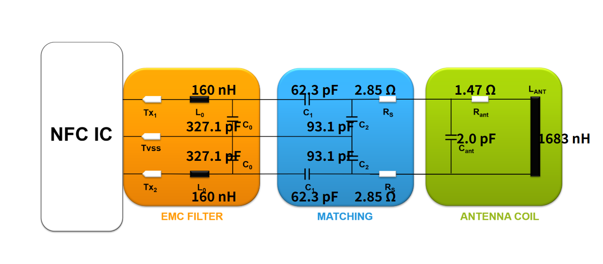

我已经设计好了天线了，根据测量的值输入的下面：

| 参数                        | 数值  | 单位 |
| --------------------------- | ----- | ---- |
| Length (amax)               | 40.64 | mm   |
| Width (bmax)                | 50.8  | mm   |
| Track width (w)             | 508   | µm   |
| Gap between tracks (g)      | 381   | µm   |
| Additional Overlap Area (A) | 0     | mm2  |
| Track Thickness             | 35    | µm   |
| Number of Turns (N)         | 4     |      |
| Turn exponent (E)           | 1.66  |      |
| PCB Thickness               | 1.59  | mm   |
| Er                          | 4.3   |      |

得到天线参数：

| Inductance (Lant)     | 1683 | nH   |
| --------------------- | ---- | ---- |
| Lant min              | 1548 | nH   |
| Lant max              | 2190 | nH   |
| Capacitance (Cant)    | 2.0  | pF   |
| Resistance (Rant)     | 1.47 | Ω    |
| Self resonance (Fres) | 86   | MHz  |

然后我需要填写天线参数，默认值如下，我需要修改吗？

| Q                | 20   |      |
| ---------------- | ---- | ---- |
| Target impedance | 20   | Ω    |
| fEMC cut off     | 22   | MHz  |
| L0               | 160  | nH   |

得到：

| Rs   | 2.85  | Ω    |
| ---- | ----- | ---- |
| C0   | 327.1 | pF   |
| C1   | 62.3  | pF   |
| C2   | 93.1  | pF   |

最终建议：

| 参数 | 推荐组合  | 实际值 |
| ---- | --------- | ------ |
| C0   | 220 + 100 | 320pF  |
| C1   | 47 + 12   | 59pF   |
| C2   | 75 + 20   | 95pF   |

